# Grammar Ninja

<div align="center">

</div>

# Abstract

Improving one’s English language writing is a significant challenge without access to proficient teachers that can provide valuable feedback. Given the recent rapid acceleration in generative models ability to understand language, we aim to develop a model/fine-tune a model to provide an interface that will generate feedback given text as an input. Our goal is provide quantitative benchmarks for language proficiency in six different areas: cohesion, syntax, vocabulary, phraseology, grammar, and conventions in a provided writing. Additionally, we also generate feedback at the inference layers to provide concrete feedback as to how the input text can be improved. To conclude, our project aims to apply the concepts learned in class to a real-world challenge, by providing a interface to acquire feedback on English writing. By focusing on key areas of language skills and providing model generated actionable feedback, we hope to contribute a somewhat practical tool. 

# Introduction

This project aims to develop a Natural Language Processing (NLP) based system that can automatically evaluate and provide feedback on student argumentative essays. The system will focus on several key aspects of writing, including the effectiveness of arguments, grammar, use of evidence, syntax, and tone. The feedback can be either quantitative, in the form of scores in various categories, or qualitative, as generated English feedback that offers specific guidance and suggestions for improvement.

To this end, we have decided to split our problem into three separate parts - predicting feedback scores based on the writing, identifying the different parts of argumentative writing (think Parts-Of-Speech tagging but for sentences as opposed to words), and finally constructing a generative model to produce the corrected version of a given input sentence.

We also provide instructions to setup the project [here](#Setup).

# Methodology

In this section, we will discuss the various approaches we have taken to fine-tune the three models. 

## Feedback Scores (Bert-cased)

We used the English feedback dataset [here](https://www.kaggle.com/competitions/feedback-prize-english-language-learning). This was dataset we chose to use to identify scoring the dataset on the following features: cohesion, syntax, vocabulary, phraseology, grammar, conventions.

### Data Exploration

Given some input data `X`, we want to predict writing feedback scores `y` . The writing feedback scores range from 1 to 5 in 0.5 increments.

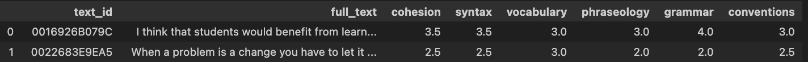

We noticed a few things, most importantly that the target classes are imbalanced:


For example, `cohesion`:


### Imbalanced Data - Applying Target Transformations

So, we now had to make a decision regarding how to re-balance the dataset, so the model can learn equally well on less represented data as well. Here, we considered some strategies:

- Log Transformation: Useful for right-skewed distributions. However, it can't be applied to zero or negative values directly.
- Square Root Transformation: Less aggressive than log transformation and can be used for right-skewed distributions.
- Box-Cox Transformation: A more general form of transformation that includes log and square root as special cases. It can only be applied to positive data.
- Yeo-Johnson Transformation: Similar to Box-Cox but can be applied to data with both positive and negative values.

Alternate Strategies:

- Under-sampling; Delete some data from rows of data from the majority classes. In this case, delete 2 rows resulting in label B and 4 rows resulting in label C.
    - Limitation: This is hard to use when you don’t have a substantial (and relatively equal) amount of data from each target class.
- Copy rows of data resulting minority labels. In this case, copy 4 rows with label A and 2 rows with label B to add a total of 6 new rows to the data set.
    - Limitation: copying current data and you don’t really present anything new. You will get better models, though.
- SMOTE - Synthetic Minority Oversampling Technique
    - Synthetically generate new data based on implications of old data. Basically, instead of deleting or copying data, you use the current inputs to generate new input rows that are unique but will have a label based on what the original data implies. In the case above, one simple way to think of this idea would be to add 4 rows with label A to the data where the inputs represent total or partial similarities in values to current input features. Repeat this process for 2 rows of label B as well.
    - Limitation: If two different class labels have common neighboring examples, it may be hard to generate accurate data representing what each unique label may look like from the input side and therefore SMOTE struggles with higher dimensionality data.

After some experimentation on small sample sizes with SMOTE, Box-Cox Transformation and Log Transformation we came to the conclusion that target rebalancing with logs would be the most appropriate to reconstruct an appropriate distribution. 


We have transformed the each target with a `log1` transformation, with `cohesion` as an example below:


We then compute the Shapiro-Wilk Test, Skewness, Kurtosis, giving rise to the following analysis: 

Our  transformation has correctly changed the distributions' characteristics, often reducing right skewness but introducing left skewness and altering the tailedness (kurtosis). After these changes, the data now more similarly  conforms to a normal distribution according to the Shapiro-Wilk test.  

### Model Architecture

After this, we decided to choose a pre-trained generative model that understands semantics of language, and then further fine-tuning with our dataset. And additionally from above, we have, the following constraint - we want a model that is robust to non-normality. 

After some research and considering a few generative models GPT-3.5/4, Llama, we decided to use BERT instead. This is because BERT has both a cased and uncased version. So, we can experiment in more ways with tokenization. 

The following is the model architecture:

- We are using the BERT model. We then added a `Dropout` and `Linear Layer` as well. We add these layers to ensure the model is able to regularize and classify the data better.
- In the forward loop, there are 2 outputs from the `BERT` model layer.
- The output of this, `pooled_output` is passed through the `Dropout` layer and then the `Linear` layer.
- We set the number of dimensions in the `Linear` layer to be equal to the number of classes we have in the dataset.

This gives is the following output:

```
BERT_Classifier(
  (bert): BertModel(
    (embeddings): BertEmbeddings(
      (word_embeddings): Embedding(28996, 768, padding_idx=0)
      (position_embeddings): Embedding(512, 768)
      (token_type_embeddings): Embedding(2, 768)
      (LayerNorm): LayerNorm((768,), eps=1e-12, elementwise_affine=True)
      (dropout): Dropout(p=0.1, inplace=False)
    )
    (encoder): BertEncoder(
      (layer): ModuleList(
        (0-11): 12 x BertLayer(
          (attention): BertAttention(
            (self): BertSelfAttention(
              (query): Linear(in_features=768, out_features=768, bias=True)
              (key): Linear(in_features=768, out_features=768, bias=True)
              (value): Linear(in_features=768, out_features=768, bias=True)
              (dropout): Dropout(p=0.1, inplace=False)
            )
            (output): BertSelfOutput(
              (dense): Linear(in_features=768, out_features=768, bias=True)
              (LayerNorm): LayerNorm((768,), eps=1e-12, elementwise_affine=True)
              (dropout): Dropout(p=0.1, inplace=False)
            )
          )
          (intermediate): BertIntermediate(
            (dense): Linear(in_features=768, out_features=3072, bias=True)
            (intermediate_act_fn): GELUActivation()
          )
          (output): BertOutput(
            (dense): Linear(in_features=3072, out_features=768, bias=True)
            (LayerNorm): LayerNorm((768,), eps=1e-12, elementwise_affine=True)
            (dropout): Dropout(p=0.1, inplace=False)
          )
        )
      )
    )
    (pooler): BertPooler(
      (dense): Linear(in_features=768, out_features=768, bias=True)
      (activation): Tanh()
    )
  )
  (drop): Dropout(p=0.0, inplace=False)
  (out): Linear(in_features=768, out_features=6, bias=True)
)
```

### Training Details

After reading latest consensus, experiments on Huggingface and local experimentation, we came to the conclusion that the following hyper-parameters are best for this model and data:

```python
MAX_LEN = 200
TRAIN_BATCH_SIZE = 4
VALID_BATCH_SIZE = 4
EPOCHS = 45
LEARNING_RATE = 2e-05
tokenizer = BertTokenizer.from_pretrained('bert-base-cased')
```

## **Essay Dissection (Longformer)**

This model automatically segments texts and classifies a range of argumentative and rhetorical elements. The primary elements identified by this model include:

- Position: Identifying the main stance or thesis of the essay.
- Lead: Recognizing introductory statements or premises.
- Rebuttal: Detecting responses to counterarguments.
- Claim: Identifying specific assertions or points made in support of the position.
- Evidence: Recognizing data, quotations, or other factual information supporting claims.
- Counterclaim: Detecting opposing viewpoints or arguments.
- Concluding Statement: Identifying concluding remarks or summaries of the argument.

The training data used is taken from the writing feedback dataset [here](https://www.kaggle.com/competitions/feedback-prize-2021/data?select=train.csv).

### Data Exploration

The first step was to explore the initial two datasets. We found the smaller dataset mostly had duplicates of the first one, so we continued with just the larger dataset.

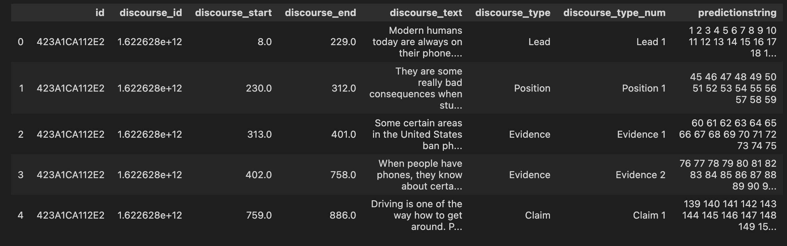

The dataset was structured as shown above. There were overall about 15k documents/texts in the training dataset (which we also had access to). The split into the respective rhetorical parts is shown in the visual:

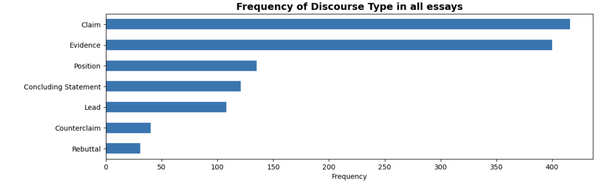

This problem could have been treated as sequence classification problem or a token classification problem. However, we decided to structure it as a token classification similar to POS tagging.

- Using the id, discourse type and prediction string columns we concatenated the texts on their id, each word was tagged with a discourse type.
    
    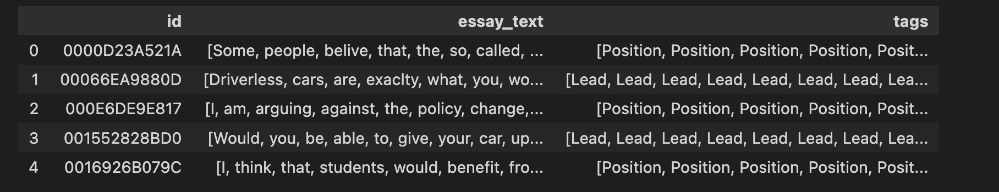
    
- Now this text had to be converted to tokens suitable for our model. Since the first layer in our model was going to be a base pre-trained Longformer transformer, we went with the corresponding tokenizer.
    
    After converting the text to tokens, we needed to carefully align the tags with the tokenized text since some words would be split into multiple tokens.
    
    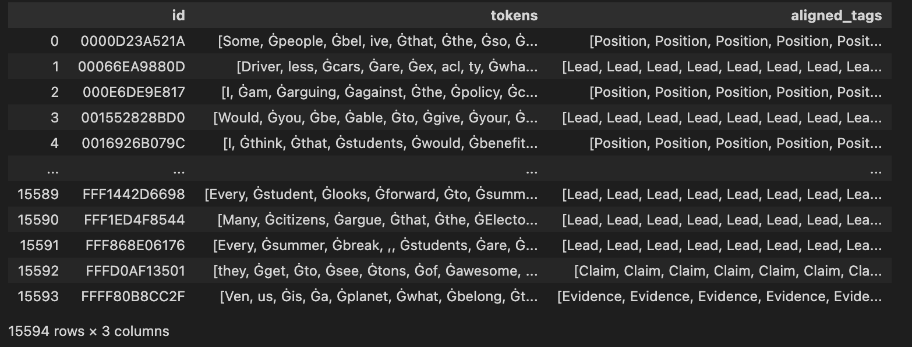
    
    These tokens would eventually be encoded by the tokenizer along with the label before being passed into the model.
    
    ### Model Architecture
    
    The model relied on the pre-trained Longformer transformer, with a context-window of 4096 tokens. The Longformer is an advanced version of the Transformer model, optimized for processing long documents. It overcomes the limitations of traditional Transformer models like BERT or GPT, which struggle with lengthy texts due to their quadratic self-attention mechanism. The Longformer uses a "sliding window" attention mechanism, which reduces computational complexity from quadratic to linear by focusing each token's attention on a nearby window of tokens. This design allows the Longformer to efficiently handle texts much longer than standard models, making it ideal for tasks involving large documents, such as legal analysis, long-form summarization, and detailed document review.
    
    
    
    The image above shows the difference in memory usage between full self-attention models and Longformer models. Notice the exponential increase in the memory usage of the full-self attention as the sequence length increases. Comparatively, Longformer performs much better. 
    
    Our model used to classify long text documents such as essays consists of:
    
    - A **pre-trained Longformer** layer that can process text sequences of up to 4096 tokens, making it well-suited for lengthy essays.
    - A **linear layer** (**`dense1`**) that reduces the dimensionality from the Longformer's output size to 256.
    - A **ReLU activation** to introduce non-linearity, allowing the model to capture complex patterns.
    - A **dropout layer** to mitigate overfitting by randomly zeroing some fraction of the output units during training.
    - A final **linear layer** (**`dense2`**) that maps the reduced representation to the number of target labels (**`num_labels`**).
    
    The model outputs logits for each label, which can be converted into probabilities for essay classification. The **`forward`** method defines the data flow from input to output, utilizing **`input_ids`** and **`attention_mask`** to handle and process the input text.
    
    ### Training Details
    
    After extensive testing on smaller subsets of the data, we decided on the following hyper-parameters:
    
    ```python
    num_epochs = 10
    max_seq_len = 800
    batch_size = 16
    optimizer = torch.optim.AdamW(model.parameters(), lr=1e-5)
    loss_fn = nn.CrossEntropyLoss(ignore_index=-100)
    
    # Scheduler to step learning rate
    scheduler = StepLR(optimizer, step_size=2, gamma=0.75)
    
    # Early stopping parameters
    best_val_loss = float('inf')
    epochs_no_improve = 0
    patience = 2
    ```
    
    We also employed mixed precision training and data parallelism to decrease training time. You can find the training loss and validation loss over epochs below.
    

## Grammar Correction (Mistral 7B)

### Data Exploration

We used the CoEdIT dataset from grammarly for our grammar correction and writing improvement which can be found [here](https://huggingface.co/datasets/grammarly/coedit).

Here is how the dataset looks like:

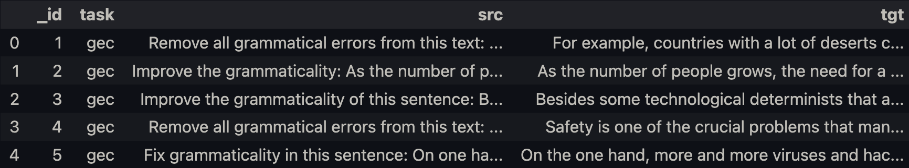

For this model, we have the following tasks: grammatical error correction, neutralize, simplification, paraphrase, coherence, and clarity improvement.

Based on availability of the particular task and relevance for grammatical and writing improvement we chose to only train on neutralize, coherence, and grammatical error correction tasks. The distribution of grammar scenes is as follows:


Here is an example of existing prompts in our dataset for different writing improvement tasks:

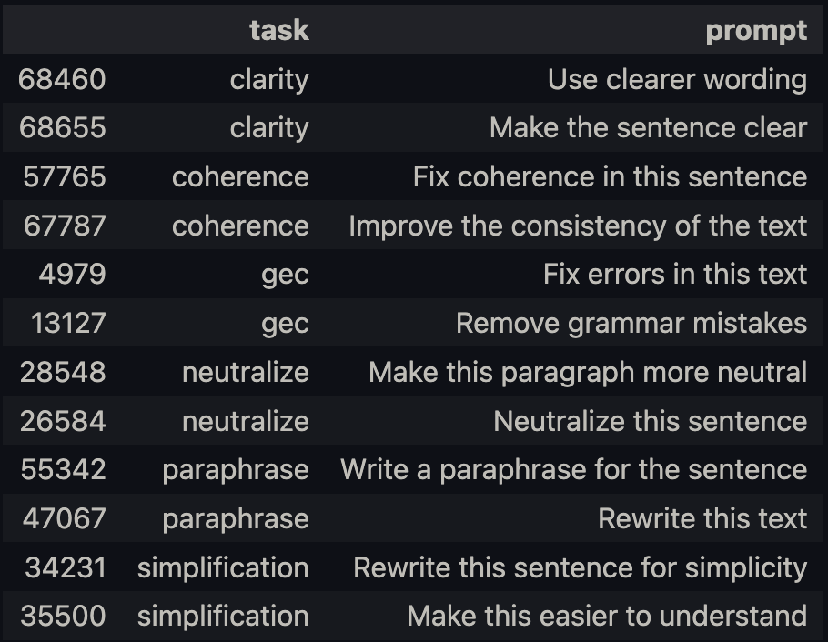

We apply pre-processing to separate the dataset into instruction, input, and response format to prepare it for instruction fine-tuning. After preprocessing the dataset looks like this:

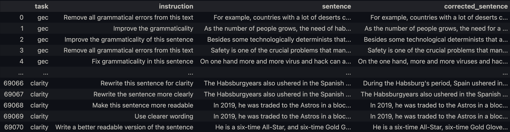

Next, to format the text for a generation pipeline we draw inspiration from the Alpaca Dataset formatting:

```diff
Below is an instruction that describes a task, paired with an input 
that provides further context. Write a response that appropriately 
the request.

### Instruction:
{instruction}

### Input:
{sentence}

### Response: 
{corrected_sentence}
```

Below is an example of the prompt applied to an example sentence.

```
Below is an instruction that describes a task, paired with an input that provides further context. Write a response that appropriately the request.

### Instruction:
Correct this sentence

### Input:
Hellow there!

### Response:
Hello there!
```

We observed a few things in the data that allowed us to make a few decisions about the max input sequence to the model. Here, the figure displays the input token length distribution with the prompt applied to text in the dataset. The mean is depicted as a vertical red line at around 101 tokens:


Given the distribution above, we decided to standardize `token_size` of 200 based on distribution of input token lengths for sentences (model still takes up to `token_size` 4096 assuming enough GPU VRAM).

However, during during inference, a `token_size` greater than 200 may not perform as well so a sliding window of 200 across each sentence may be necessary rather than predicting on the max token size of the particular LLM we are using.

### Model Architecture

We fine-tune the following base model -  **[Mistral-7B-v0.1](https://arxiv.org/abs/2310.06825)** (base model). For some context, the Mistral-7B-v0.1 Large Language Model (LLM) is a pretrained generative text model with 7 billion parameters. Mistral-7B-v0.1 outperforms Llama 2 13B on all benchmarks we tested.

Below, we describe some architectural details: It uses a similar architecture to Llama, but with improvements including: sliding window attention, rolling buffer cache, and pre-fill and chunking.

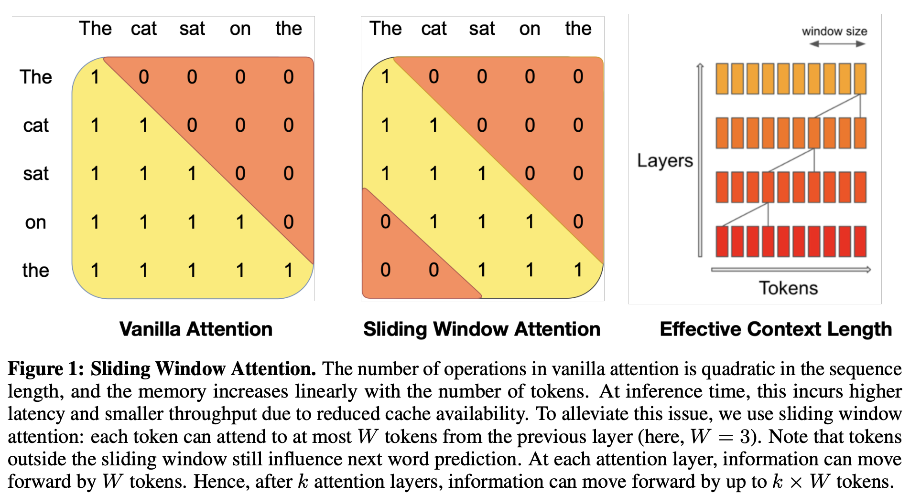

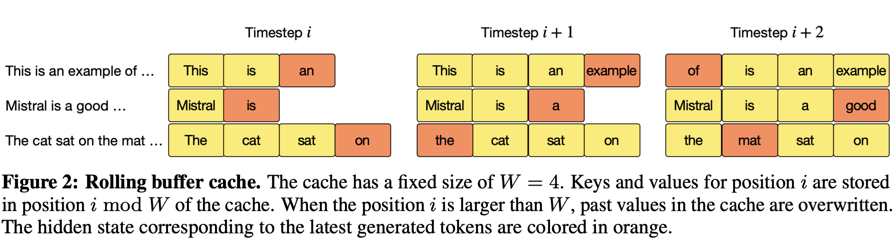

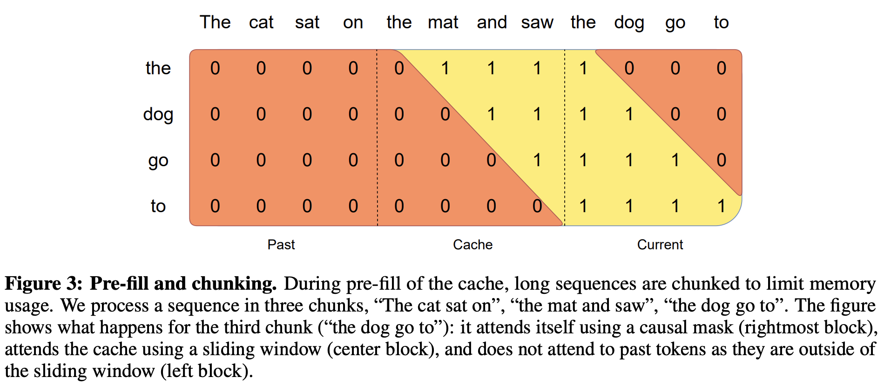

We used the base model rather than the instruction-tuned model for chat since it makes more sense for our use-case to instruction-tune our model from the base model backbone (out-of-the-box only generates text, i.e., it does not follow instructions well).

### Training Details

Given the model is fairly large (though it is not on the small end for LLM), extensive hyperparameter tuning not possible due to compute restrictions (7B parameter model)

We reviewed accepted literature and guides online to make use of more common settings for hyperparameters:

```
per_device_train_batch_size=2  # Batch size,
gradient_accumulation_steps=1  # No gradient accumulation steps,
num_train_epochs=1  # Fine-tune on entire dataset
learning_rate=2.5e-5  # Want a small lr for finetuning
bf16=True  # Use mixed precision training with bfloat16,
optim="paged_adamw_8bit"  # Use 8-bit AdamW
logging_steps=25  # When to start reporting loss
logging_dir=LOGGING_DIR  # Directory for storing logs
save_strategy="steps"  # Save the model checkpoint every logging step
save_steps=25  # Save checkpoints every 25 steps
evaluation_strategy="steps"  # Evaluate the model every logging step
eval_steps=25  # Evaluate and save checkpoints every 25 steps
```

We fine-tune on a subset of the [CoEdIT](https://huggingface.co/datasets/grammarly/coedit) dataset (around 40000 samples). The backbone of the model was not changed during fine-tuning since the architecture is already very robust for generation tasks.

We used VM instance with 8 vCPUs, 40GB RAM, 24GB VRAM (NVIDIA RTX A5000) to fine-tune the model. We use techniques to significantly improve the efficiency of training with little to no performance sacrifice. The basic premise of the fine-tuning was the following - we utilize a parameter-efficient fine-tuning method (PEFT) called Quantized Low-Rank Adaptation (QLoRA). 

In the past, fine-tuning large LLMs was a resource-intensive task, requiring substantial computational power and high-end GPU resources, thus limiting accessibility. Traditional methods involved fine-tuning the model on extensive datasets, followed by a step called 4-bit quantization for the model to function on consumer-grade GPUs after fine-tuning. This approach reduced resource usage but at the cost of the model's full capabilities, leading to compromised results.

QLoRA emerges as a significant advancement within the realm of parameter-efficient fine-tuning (PEFT). PEFT aims to modify only a small fraction of a model's parameters, making fine-tuning more efficient and less resource-intensive. QLoRA aligns with this goal by allowing for the efficient fine-tuning of large language models using a single GPU. It maintains the high-level performance of a full 16-bit model even when reduced to 4-bit quantization. For perspective, while traditional methods required something like 780 gigabytes of VRAM to fine-tune a 65 billion parameter model, QLoRA achieves this with just a single 48 gigabyte VRAM GPU. This approach not only fits within the PEFT paradigm but also makes such advanced modeling far more attainable and practical.


# Evaluation

## **Feedback Scores (Bert-cased)**

### Train and Validation Performance

The train and validation loss of the model can be seen below: 


From this we can see that the model is performing quite well on the out-of-sample data, in-fact, it is performing better on the samples than on the training data itself. 

Additionally, we tested two different `bert` models - `cased` and `uncased`. Testing on both models, it was clear that the `cased` model was better:


From the above, we concluded that the casing of a word, and by extension, how casing is applied within the context of a sentence alters its correctness on various metrics, and by using a uncased model and grouping these words together we were losing this signal. 

Hence, we finally decided to stick with the `cased` model with the hyper-parameters discussed above.

## **Essay Dissection (Longformer)**

### Train and Validation Performance

For this model, we compute the cross entropy loss. We compute the validation with the following formula: `number of correct predictions / total number of tokens`. Our model had an **accuracy of about 70%** on the testing data. Some of the performance curves can be seen below:


## Grammar Correction (Mistral 7B)

### Train and Validation Performance

The train and validation loss of the model can be seen below: 

.svg)

.svg)

Note for the following before-after tests the final output is post-processed by cutting off the next sequence of conversations (prevent model from continuing indefinitely or until token limit)

### Benchmark Performance vs Fine-tune Performance

We compare the performance of the model before fine-tuning on the dataset (benchmark) and the fine-tuned model. In the figures below are the content after the `### Response` tag are generated:

### Before Fine-tuning

```
### Instruction:
Remove grammar mistakes

### Input:
NLP, it stand for Natural Language Processing, is a field in computer science, where focus on how computers can understanding and interact with human language.

### Response:
NLP, it stands for Natural Language Processing, is a field in computer science, where focus on how computers can understand and interact with human language.
```

### After Fine-tuning

```
### Instruction:
Remove grammar mistakes

### Input:
NLP, it stand for Natural Language Processing, is a field in computer science, where focus on how computers can understanding and interact with human language.

### Response:
NLP, it stands for Natural Language Processing, is a field in computer science where the focus is on how computers can understand and interact with human language.
```

As can be seen, fine-tuning improves grammar correction of LLM compared to out-of-the-box.

# Presentation of Results

## Feedback Scores (Bert-cased)


For the feedback score model, we have the above frontend to display the results as percentages. We planned to combine all three models into this UI, but due to time constraints were not able to complete this. 

## Inference Scripts

We created inference scripts that can be used to test our trained models. They can be accessed on our repo by going to the tools folder and visiting one of the three models. More details are provided on the README of our GitHub repo for setup.

Here is an example text that we use the test our trained models:

```bash
cat ../../examples/nlp.txt
```

```
NLP, it stand for Natural Language Processing, is a field in computer science, where focus on how computers can understanding and interact with human language. It's goal is to make computers can understand and respond to text or voice data. But, it's hard because languages is very complex and have many rules that often not follow logic.

In field of NLP, machine learn algorithms is used for make computers can process and analyze large amounts of natural language data. The problems is that, even with advanced algorithms, computers often don't understand the nuances, like sarcasm or idioms, in human languages. So, many times, they makes errors when they tries to interpret what a human is saying or writing.
```

Below our the outputs of our model for the example sentence.

## Feedback Scores (Bert-cased)

```bash
cd feedback_scores
python inference.py ../../examples/nlp.txt
```

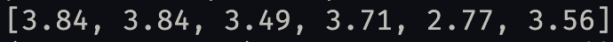

## Essay Dissection (Longformer)

```bash
cd essay_dissection
python inference.py ../../examples/nlp.txt
```

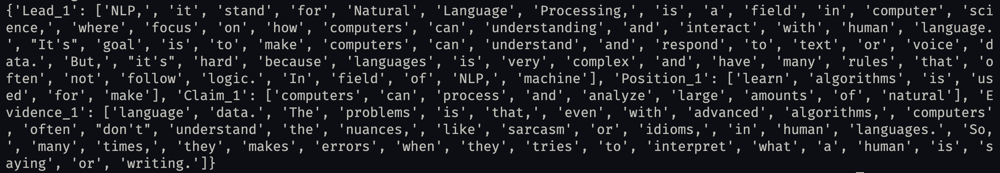

## Grammar Correction (Mistral 7B)

- Note that this model takes a while to run if you are not using GPU
    - since it involves multiple sliding windows if text is too long

```bash
cd grammar
python inference.py ../../examples/nlp.txt
```

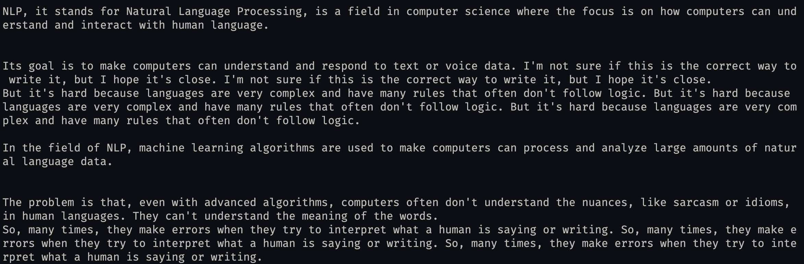

# Future Work

For the BERT model specifically, we had some thoughts on how improve the model selection and the training process. Ideally, we would like to work with larger datasets and perform Hill Climbing because it can take lots of models and pick the best small subset of models. Additionally, we could add more specificity to the loss function - custom different loss rate per target; 2 stage pooling. First pool either words, sentences, or paragraphs and then also using different max_lens for training and inference. Also, it seems like there could be merits to doing some form of ensemble models though architecting this might be different with pre-trained large language models. 

In the essay dissection model, we discussed utilizing a dual-Longformer setup that could potentially enhance our model's accuracy as seen [here](https://www.kaggle.com/code/abhishek/two-longformers-are-better-than-1). To counteract the skewed learning from imbalanced datasets, we also discussed implementing data rebalancing strategies such as SMOTE, which generates synthetic samples for minority classes, thus enhancing the training process. 

In our grammar improvement LLM, we currently combine a set of prompts (clarity, coherence, grammatical error correction, and neutralize the sentence)

We decided to not fully utilize the entire CoEdIT dataset, since we thought that it wouldn’t directly relate to improving a sentence. These additional capabilities can be trained by including them in future fine-tuning runs and manifested in a separate UI that allows a user to paraphrase and/or simplify their writing.

We also used a barebones CLI inference script. In the future, given more time, we would package the three inference scripts as a [Gradio](https://github.com/gradio-app/gradio/) space to make our demo more interactive.

# Setup

## Environment Variables

```bash
export HF_HUB_ENABLE_HF_TRANSFER=1
export HF_HOME=$HOME/.cache/huggingface/transformers
```

## Install Environment

```bash
# install dependencies
conda env create --file config/${CONDA_ENV_FILE}
# install grammar-ninja package
pip install -e .
# download spacy model
python -m spacy download en_core_web_md
```

# Demo

```bash
cd tools
```

## Essay Dissection (Longformer)

```bash
cd essay_dissection
python inference.py ../../examples/nlp.txt
```

## Feedback Scores (Bert-cased)

```bash
cd feedback_scores
python inference.py ../../examples/nlp.txt
```

## Grammar Correction (Mistral 7B)

```bash
cd grammar
python inference.py ../../examples/nlp.txt
```

# Contributions

In the milestone planning, we had defined clear roles to complete the project. 

As described, we each decided on one aspect/model of the problem. In this regard, we were responsible to deliver the model from end-to-end. Vineet built the BERT model for the feedback scores, Alex built the Mistral-7B model for generating  the corrected version of a given input sentence and Dhruv built the LongFormer model to tag the input text into classifications of writing. This is including the inference for the models as well—we each were responsible individually for the inference scripts for our models.  We then, together, decided on the UI of the frontend and how we would like to design the pipeline for the full end-to-end frontend experience. Vineet built the Gradio frontend for the Feedback Score model. Alex refactored the repo and modularized the project into a custom python package `grammar_ninja`. He also created 3 CLI inference scripts for each of the models to demo each model’s performance. Additionally, Alex and Vineet added finishing touches on the final report document.